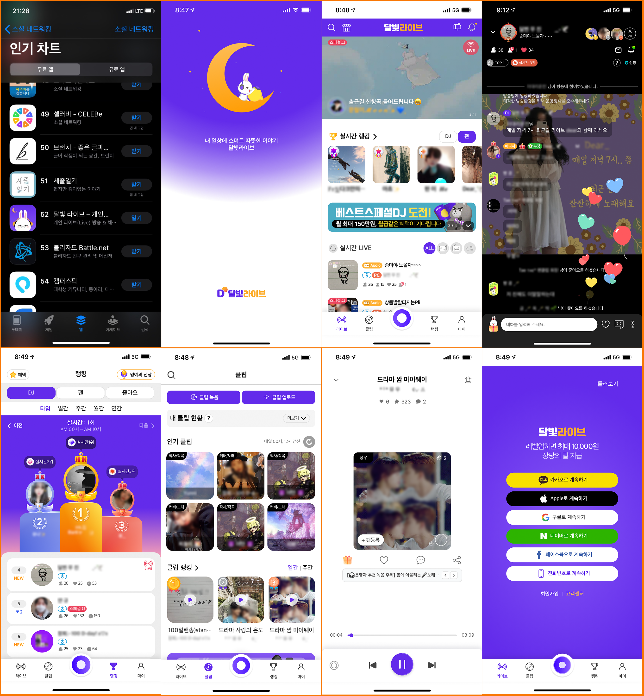
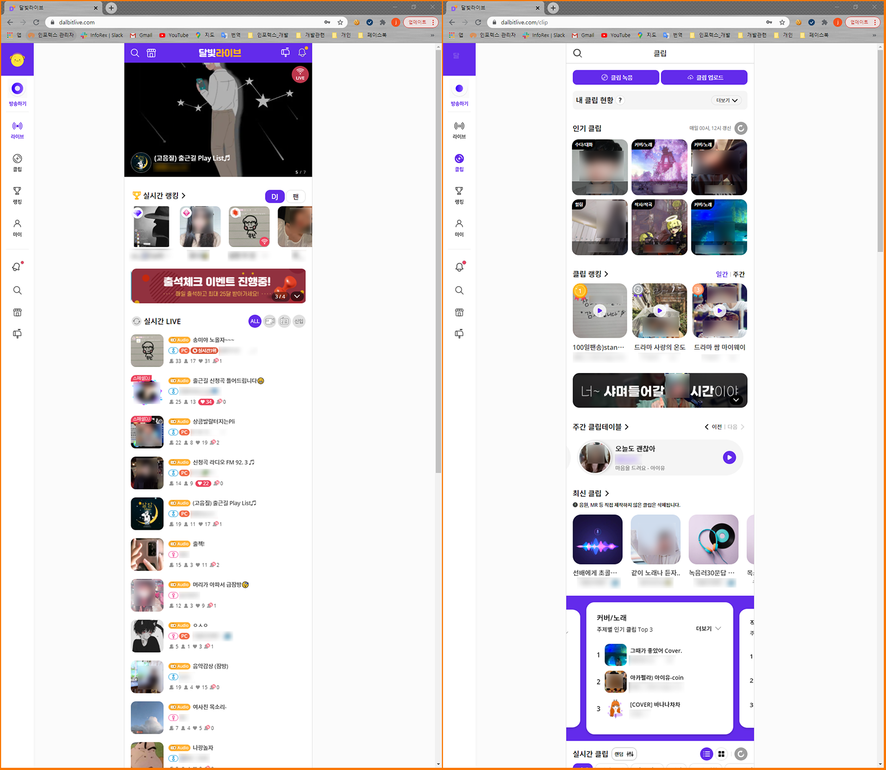
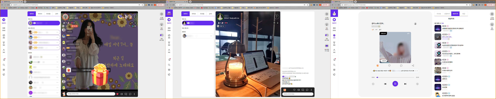

# 달빛라이브
라이브 스트리밍 플랫폼 서비스 
BackEnd(Restful, Pay, Photo, Admin, DB), FrontEnd 개발 총괄 
19.11 ~ 개발 
20.05 ~ 오픈 및 운영 
 
※ FrontEnd React는 서비스 로직 및 운영 작업을 주로 하였으며, 실 개발은 소수 참여

## 개발 환경
BackEnd : JAVA8, SpringBoot(2.2.1) + (Session, Security, JWT), mariaDB, Redis, Maven 
FrontEnd : React 16.8
ETC : node.js, WOWZA, antMedia

## 개발 툴
IntelliJ, Git, Jenkins, Slack, DBeaver, Medis

## Sample Source
회원로그인 관련 소스 일부 
./db : 로그인 관련 프로시저 
./backEnd : 로그인 관련 Restful 소스

## APP
IOS : https://apps.apple.com/us/app/id1490208806 
AOS : https://play.google.com/store/apps/details?id=kr.co.inforexseoul.radioproject 

## PC
https://www.dalbitlive.com 
 

